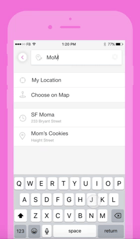
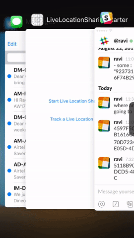
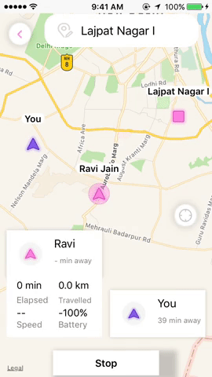

<a href="https://hypertrack.com/">
    
</a>

Activity Tracking and Live Location Sharing  
===========================================

[](https://opensource.org/licenses/MIT) [](https://opensource.org/licenses/MIT)  [](http://slack.hypertrack.com)


This open source repo uses [HyperTrack](https://www.hypertrack.com) for Live Location Sharing and Activity Tracking.
Hypertrack Live helps you share your Live Location with friends through your favorite messaging app when on the way to meet up. You can also see your activities organized as chronological cards so that tapping on each card gives you the locations of the activity. In case you are using Android, refer to our open source Android [repository](https://github.com/hypertrack/hypertrack-live-android). 

| Usecase       |  Description  |  Tutorial     |
| ------------- | ------------- | ------------- |
| Activity Tracking  | Track your activities chronologicaly through the day. [Description](#activity-tracking) | [Build yourself 👩‍💻](#build-placeline-in-your-app) |
| Live Location Sharing  | Share your Live Location with friends and see theirs. [Description](#live-location-sharing) | [Build yourself 👩‍💻](#build-live-location-sharing-using-hypertrack)|


- [Activity Tracking](#activity-tracking)
- [Live Location Sharing](#live-location-sharing)
- [Usage](#usage)
- [Build Activity Tracking in your app](#build-activity-tracking-in-your-app)
- [Build Live Location Sharing in your app](#build-live-location-sharing-in-your-app)
- [Documentation](#documentation)
- [Contribute](#contribute)
- [Support](#support)


## Activity Tracking
One of the two core features of Hypertrack Live is Placeline. Placeline is useful in tracking your daily activity with near-zero battery impact. We automagically use the combination of device sensors - GPS, WiFi, network, accelerometer, pedometer, gyroscope, compass - to deliver accuracy. Placeline is powered by the HyperTrack SDK which collects location and activity data for your users. It includes segments like stop 🛑, walk 🚶‍♀️,run 🏃‍♀️,drive 🏎️ and cycling 🚴. 


## Live Location Sharing
The other core feature of Hypertrack Live is Live Location Sharing. Live Location Sharing is useful for consumer apps like messengers and social apps where two or more people want to share their Live Location with each other when on the way to meet up. It is also useful for marketplace aggregators where the transaction starts online 💻📱 but requires people to meet offline for fulfillment. It helps you solve the consumer's anxiety of “where are you⁉️”.

 


## Usage
#### To use this app

```bash
# Clone this repository
$ git clone https://github.com/hypertrack/hypertrack-live-ios.git

# Go into the repository
$ cd hypertrack-live-ios/htlive-ios

# Install dependencies
$ pod install
```

Get your HyperTrack API keys [here](https://dashboard.hypertrack.com/signup?utm_source=github&utm_campaign=ht_live_ios), and add the publishable key to ```setUpHypertrack``` function in [HyperTrackAppService.swift](https://github.com/hypertrack/hypertrack-live-ios/blob/master/htlive-ios/htlive-ios/HyperTrackAppService.swift) file.
```swift
HyperTrack.initialize("YOUR_PUBLISHABLE_KEY")
```

## Build Activity Tracking in your app 
 - [Placeline format](#placeline-format)
 - [Setup HyperTrack SDK](#setup-hypertrack-sdk)
 - [Create Hypertrack user](#create-hypertrack-user)
 - [Start tracking](#start-tracking)
 - [Get Placeline View in your app](#get-placeline-view-in-your-app)
 - [Use Placeline Data in your app](#use-placeline-data-in-your-app)


#### Placeline format
Placeline object contains detailed information about the activity like the start time, end time, location, steps and more.
An example JSON representation is given [here](https://docs.hypertrack.com/gettingstarted/activities.html#placeline).
#### Setup HyperTrack SDK
Set up the HyperTrack SDK by following these [instructions](https://docs.hypertrack.com/sdks/ios/setup.html).

#### Create HyperTrack user
The next thing that you need to do is create a HyperTrack User. This would tag the location/activity data to the user and help you get useful filtered data in the form of Placeline. More details about the function [here](https://docs.hypertrack.com/sdks/ios/basic.html#step-1-create-sdk-user). 

```swift
HyperTrack.createUser(userName) { (user, error) in
    if (error != nil) {
     // Handle error on get or create user
     print("recieved error while creating user. error : " + (error?.errorMessage)!)
     return
    }
                
     if (user != nil) {
     // User successfully created
     print("User created:", user!.id ?? "")
     HyperTrack.startTracking()
     }
}
```

#### Start tracking
Start tracking for the created user by calling the following method
```swift
HyperTrack.startTracking()
```
#### Get Placeline View in your app
To get the placeline view in your ViewController, just call the getPlacelineView function. It takes the desired frame of the view and date as parameter. If you don't specify the date, the default date chosen is today's date.

```swift
override func viewDidAppear(_ animated: Bool) {
        super.viewDidAppear(true)
        // get placeline view with a frame size and date.
        let placelineView =  HyperTrack.getPlacelineView(frame: self.view.frame,forDate: Date())
        // add placeline view as subview
        self.view.addSubview(placelineView)
}
```

#### Use Placeline Data in your app
Once tracking has started, implement the following function and you are all set to use the rich activity data in your app.

```swift
HyperTrack.getPlaceline { (placeLine, error) in
    guard let fetchedPlaceLine = placeLine else { return }
        if let segments = fetchedPlaceLine.segments {
                // process the segment here 
            
         }
}
```

We hope that you got a good taste of Placeline. If you have any problems or suggestions for the tutorial, do not hesitate to buzz 🐝 us [here](#support).


## Build Live Location Sharing in your app 

Use the following tutorial to build  [Live Location Sharing](#live-location-sharing) in your app. This is divided into three section.
1. In the first section, we will do a basic setup of Hypertrack SDK. 
2. In the second section, we will select a destination and start a Live Location trip to that place. 
3. In the last section, we will get your friend to join the trip started by you. 

Let's get started 😊 . Strap yourself in and get ready for an exciting ride 🚀 .

- [Basic setup](#basic-setup)
  - [Get API keys](#step-1-get-api-keys)
  - [Use starter project](#step-2-use-starter-project)
  - [Setup HyperTrack SDK](#step-3-setup-hypertrack-sdk)
  - [Create HyperTrack user](#step-4-create-hypertrack-user)
- [Start a Live Location trip](#start-a-live-location-trip)
  - [Show Live Location view](#step-1-show-live-location-view)
  - [Create and track action](#step-2-create-and-track-action)
  - [Share your trip](#step-3-share-your-trip)
- [Track or join an ongoing trip](#track-or-join-an-ongoing-trip)
  - [Track ongoing trip](#step-1-track-ongoing-trip)
  - [Join ongoing trip](#step-2-join-ongoing-trip)

  
### Basic Setup
#### Step 1. Get API keys
Get your HyperTrack API keys [here](https://dashboard.hypertrack.com/signup?utm_source=github&utm_campaign=ht_live_ios).

#### Step 2. Use starter project
We have created a starter project so that building Live Location Sharing becomes very easy and quick. It will prevent you from the hassle of creating a new project and the workflow to enable Live Location Sharing. If you want to directly build the flow in your own app or wanted to create a new project, you can ignore this step.

```bash
# Clone this repository
$ git clone https://github.com/hypertrack/hypertrack-live-ios.git

# Go into the starter folder in the repository
$ cd hypertrack-live-ios/starter/

# Install dependencies
$ pod install
```

Open LiveLocationSharingStarter.xcworkspace.

#### Step 3. Setup HyperTrack SDK
If you are NOT using the starter project, set up the HyperTrack SDK by following these [instructions](https://docs.hypertrack.com/sdks/ios/setup.html). Else, initialize the SDK by putting the following code in            ```AppDelegate```.

```swift
func application(_ application: UIApplication, didFinishLaunchingWithOptions launchOptions: [UIApplicationLaunchOptionsKey: Any]?) -> Bool {
    HyperTrack.initialize(YOUR_PUBLISHABLE_KEY)
    HyperTrack.requestAlwaysAuthorization()
    HyperTrack.requestMotionAuthorization()
    return true
}
```

#### Step 4. Create HyperTrack user
The next thing that you need to do is to create a HyperTrack user. It helps us tag the location/activity data with the user and share their Live Location status with friends. More details about the function here(https://docs.hypertrack.com/sdks/ios/basic.html#step-1-create-sdk-user). 

When the user is created, we need to start tracking his location and activity. Call the following method to do so ```HyperTrack.startTracking()```

For starter project, go to ```UserProfileViewController.swift```. When the user taps login, get the name of the user and use the following function to create a user.

```swift
HyperTrack.createUser(userName!) { (user, error) in
      if (error != nil) {
       // Handle error on get or create user
           print("recieved error while creating user. error : " + (error?.errorMessage)!)
           return
     }
                
      if (user != nil) {
        // User successfully created
         print("User created:", user!.id ?? "")
         HyperTrack.startTracking()
         self.showAlert(title:"Step 4  completed", message: "Yay Hypertrack User is Created",buttonTitle: "OK, What's Next ?" ){(action) in
         self.dismiss(animated:true, completion: nil)
          }
      }
 }
```

 

### Start a Live Location trip
Are you ready to rock and roll?

#### Step 1. Show Live Location view
Now to start a Live Location trip, the first thing that you need to do is to add a destination. For this, we will need a location picker. The good news is that HyperTrack Location View has a location picker within it. Once the user selects a location with the help of our inbuilt location picker, than the sdk gives a callback to the app with the selected location so that the app can start a trip. 

For starter project, go to ```ShareLiveLocationVC.swift```. Embed the Live Location view in your ```ViewController``` view. This should be done in - override ```func viewDidAppear(_ animated: Bool)```.

```swift
// get an instance of hypertrack's map view (it's a location picker + map view)
hyperTrackMap = HyperTrack.map()
// enable Live Location Sharing
hyperTrackMap?.enableLiveLocationSharingView = true
hyperTrackMap?.showConfirmLocationButton = true
// gives callbacks when a user interacts with the map, like when he selects a location or press a refocus button
hyperTrackMap?.setHTViewInteractionDelegate(interactionDelegate: self)
if (self.hypertrackView != nil) {
    hyperTrackMap?.embedIn(self.hypertrackView)
}
```

Also, create an extension to handle interaction delegate callback. An interaction delegate helps you get a callback when the user performs an action on HyperTrack's location view. For example, when he selects a location or taps the refocus button.
For starter project, it is already in there so nothing to do for you.
``` swift
extension ShareLiveLocationVC:HTViewInteractionDelegate {

}
```

Implement this function in the above extension. You will get a callback when a user selects a location.
```swift
// HTViewInteractionDelegate callback when user selects a location
func didSelectLocation(place : HyperTrackPlace?){
    
}
```

 

#### Step 2. Create and track action

When the user selects a location, you will get a callback in the ```didSelectLocation``` function of your ```HTViewInteractionDelegate``` extension. This is the right time to start a trip. For starting a trip, you need to create a session. This can be achieved by creating a 'visit' [action](https://docs.hypertrack.com/api/entities/action.html).  
You will need two things to create an action. 
1. ```expectedPlace``` - This is the destination for the visit. You have it after you select the destination.
2. ```lookupId``` - A ```lookpupId``` is an identifier created by you for the Live Location trip. A ```lookupId``` is what needs to be shared with the friend, so they can join your trip and share their location. We chose it to be the UUID. You can use your own internal identifiers. 

For starter project, go to ```ShareLiveLocationVC.swift``` and add the following code when you get a callback of location selection ```didSelectLocation```.
```swift
let htActionParams = HyperTrackActionParams()
htActionParams.expectedPlace = place
htActionParams.type = "visit"
htActionParams.lookupId = UUID().uuidString

HyperTrack.createAndAssignAction(htActionParams, { (action, error) in
    if let error = error {
        print("recieved error while creating and assigning action. error : " + (error.errorMessage))
        return
    }
    if let action = action {
        
        HyperTrack.trackActionFor(lookUpId: action.lookupId!, completionHandler: { (actions, error) in
            if (error != nil) {
                return
            }
            
        })
        
        return
    }
})
```

Also, implement the following function in the extension(```ShareLiveLocationVC:HTViewInteractionDelegate```) so the action gets completed when the user taps stop.

```swift
// HTViewInteractionDelegate callback when user clicks stop Live Location Sharing, You should mark your action as complete 
// when this is called.
func didTapStopLiveLocationSharing(actionId : String){
    HyperTrack.completeAction(actionId)  
}
 ```
 
 

#### Step 3. Share your trip
As described earlier, a ```lookpupId``` is an identifier which identifies a Live Location trip. When you want to share your trip, your trip's ```lookupId``` needs to be shared.
```swift
// HTViewInteractionDelegate callback when user clicks share my trip to others
func didTapShareLiveLocationLink(action : HyperTrackAction){

}
```
You can share your ```lookupId``` to the other person in different ways. 
1. You can use the ```UIActivityViewController``` to share it through messaging apps.
2. You can use your backend to send the ```lookupId```. 

For starter project, let us keep it simple and use ```UIActivityViewController``` to do the job for us.
```swift
func didTapShareLiveLocationLink(action : HyperTrackAction){
    if let lookupId = action.lookupId {
        let textToShare : Array = [lookupId]
        let activityViewController = UIActivityViewController(activityItems: textToShare, applicationActivities: nil)
        activityViewController.completionWithItemsHandler = { activityType, complete, returnedItems, error in
        }
        self.present(activityViewController, animated: false, completion: nil)
        
    }
}
```


### Track or join an ongoing trip
If you have completed the steps in above section, you have a user who has started a Live Location session. Once their friend receives a ```lookupId``` (either through your own backend or through a messaging app), she can use it to track the user and optionally join the trip if you add a few lines of code as described in the following steps.

#### Step 1. Track ongoing trip
To track the user, use the following function. Although the tracking has started in the SDK, visualizing it requires you to embed HyperTrack's map fragment in your tracking view controller. 
```swift
 HyperTrack.trackActionFor(lookUpId: lookUpId, completionHandler: { (actions, error) in
    
    if let _ = error {
        print("recieved error while tracking via lookupId. error : " + (error.errorMessage))
        return
    }
    if let actions = actions {
        if actions.count > 0 {
            // embed your map view here
        }
    }
})
 ```
 
For starter project, you have to enter the ```lookupId``` in the text field that you have received from the user who has started the session. Add the following code in the selector of track button ```onTrackClick``` in ```TrackLiveLocationVC.swift```.
 
 ```swift
HyperTrack.trackActionFor(lookUpId: lookUpId!, completionHandler: { (actions, error) in
    
    if let _ = error {
        print("recieved error while tracking via lookupId. error : " + (error.errorMessage))
        return
    }
    if let actions = actions {
        if actions.count > 0 {
            self.expectedPlace = actions.last?.expectedPlace
            let map = HyperTrack.map()
            map.enableLiveLocationSharingView = true
            map.setHTViewInteractionDelegate(interactionDelegate: self)
            if (self.hypertrackView != nil) {
                self.hyperTrackMap = map
                self.hyperTrackMap?.embedIn(self.hypertrackView)
            }
        }
    }
})

 ```
 
Now to see the result, go to the other device and set up the user. After that click on 'Track a Live Location trip' and paste/enter the ```lookupId``` which you recieved from the user. 

 

 
#### Step 2. Join ongoing trip
In this step, we will see how the friend can share her Live Location and join the trip. To join the trip, an action with the same lookupId needs to be created. This step is similar to Step 6. But this time it is a lookupId of an existing trip and NOT a new one in Step 6.

For starter project, add this code to ```shareLocationClicked``` when the user taps the 'Share Live Location' button. It creates and assign action for your friends Live Location session.
```swift
let htActionParams = HyperTrackActionParams()
htActionParams.expectedPlace = expectedPlace
htActionParams.type = "visit"
htActionParams.lookupId = self.lookupIdTextField.text!

HyperTrack.createAndAssignAction(htActionParams, { (action, error) in
    if let error = error {
        print("recieved error while create and assign action. error : " + (error.errorMessage))
        return
    }
})
```
 


We hope you’ve enjoyed yourself on your epic quest to build a Live Location feature. If you have any problems or suggestions for the tutorial, please do not hestitate to buzz 🐝 us [here](#support).

## Documentation
For detailed documentation of the APIs, customizations and what all you can build using HyperTrack, please visit the official [docs](https://docs.hypertrack.com/).

## Contribute
Feel free to clone, use, and contribute back via [pull requests](https://help.github.com/articles/about-pull-requests/). We'd love to see your pull requests - send them in! Please use the [issues tracker](https://github.com/hypertrack/hypertrack-live-ios/issues) to raise bug reports and feature requests.

We are excited to see what Live Location feature you build in your app using this project. Do ping us at help@hypertrack.com once you build one, and we would love to feature your app on our blog!

## Support
Join our [Slack community](http://slack.hypertrack.com) for instant responses. You can also email us at help@hypertrack.com.


